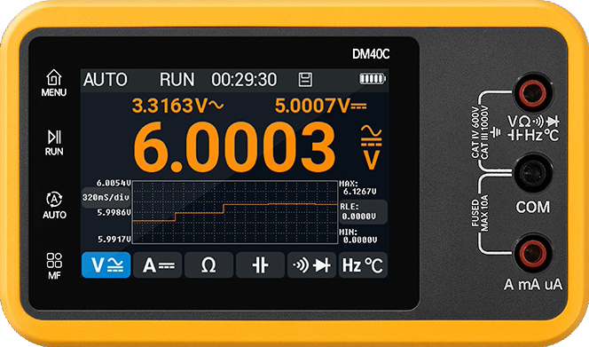
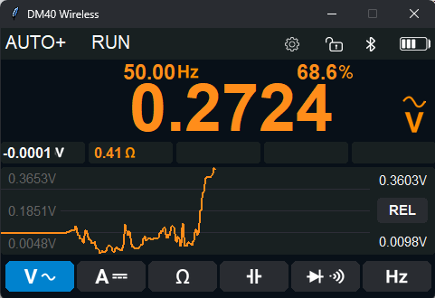
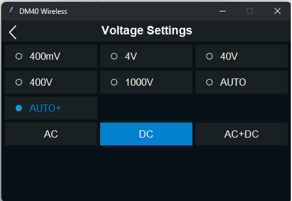
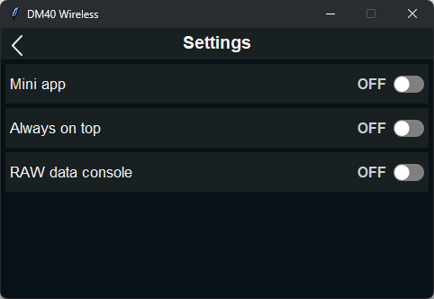
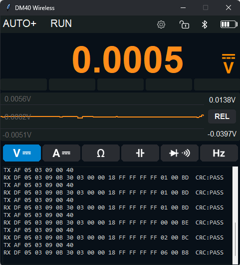
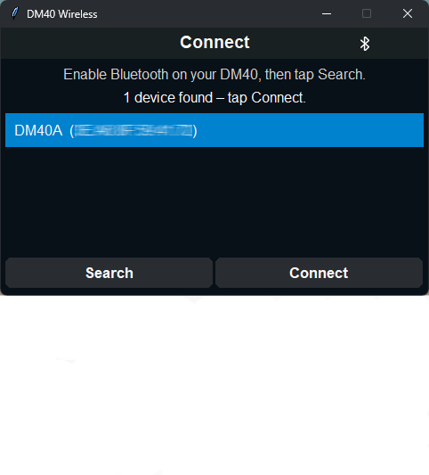
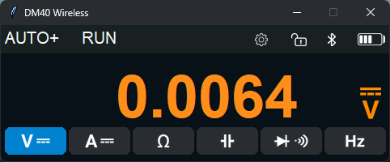
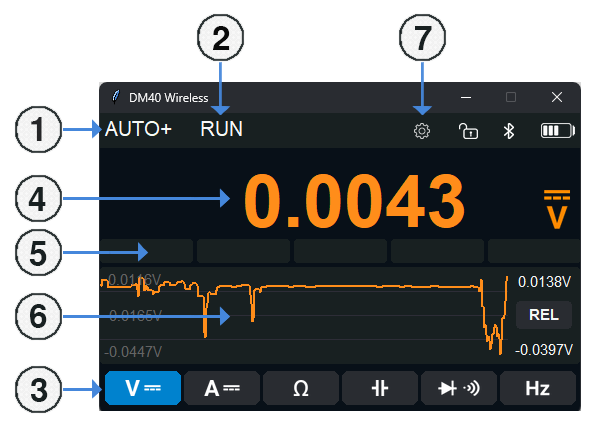
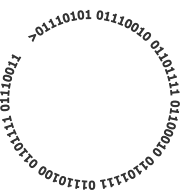

# DM40 Wireless

<p align="center" width="100%">
    
</p>

A Windows desktop app that connects over **Bluetooth Low Energy (BLE)** to the wireless **Alientek DM40** multimeter (DM40A, DM40B, DM40C). The UI mirrors the device display, including measurement modes, ranges, HOLD, and saved values.

**Repository:** [github.com/Urobotos/DM40-Wireless](https://github.com/Urobotos/DM40-Wireless)

| Branch | Purpose |
|--------|---------|
| `main` | Stable releases matching GitHub Releases |
| `develop` | Active development, new features and fixes |

<br>

---

## Requirements:

- **Windows 10/11** with working Bluetooth (BLE)
- **Alientek DM40** multimeter (A / B / C) within range
- To run from source: **Python 3.11+** ([python.org](https://www.python.org/)) — check *Add python to PATH* during installation

<br>

---

## Running from Windows (Installation for end users):

**1.** Open [Releases](https://github.com/Urobotos/DM40-Wireless/releases) on GitHub and download **`DM40-Wireless-win64.zip`**

**2.** Extract the zip to any folder (e.g. `C:\Apps\DM40 Wireless\`)

**3.** Run **`DM40 Wireless.exe`**

**4.** On first launch, the **Connect** screen appears — search for your meter, select it in the list, and click **Connect**. The MAC address is saved to `settings.json` next to the exe; on the next launch the app connects automatically.

> The distribution package is the full `dist\DM40 Wireless` build folder (exe + libraries). Do not move the `.exe` alone — it must stay next to the `_internal` folder and `images`.

<br>

---

## Running from source (developers):

```bat
git clone -b develop https://github.com/Urobotos/DM40-Wireless.git
cd DM40-Wireless
install.bat
```

On first run, copy the settings template:

```bat
copy settings.example.json settings.json
```

Then start the app using one of these:

| Method | Description |
|--------|-------------|
| **`DM40 Wireless.bat`** | Recommended — runs `app.pyw` without a console (uses venv if present) |
| **`app.pyw`** | Double-click or `pythonw app.pyw` — no console |
| **`app.py`** | PowerShell cmd: `python app.py` — with console (debugging, logs) |

<br>

---

## App Screenshots:

<p align="left" width="100%">
    
    
    
    
    
    
    
</p>

<br>

---

## Using the app:

### Connect screen (first launch / empty MAC)

- **Search** — scan for nearby DM40 BLE devices
- Click a list row — select a device
- **Connect** — save MAC and model, connect, and go to the main screen

### Main screen

<p align="left" width="100%">
    
</p>

| Area | Action |
|------|--------|
| **1. AUTO+** | Opens the **RANGE screen** menu for the current mode |
| **2. RUN / HOLD** | Toggles measurement hold |
| **3. MODE buttons** | Cycle sub-modes: VDC/VAC, ADC/AAC, OHM, CAP, DIODE/CONT, Hz/TEMP |
| **4. Display digits** | Main display digits |
| **5. Save slots** | Click on the **display digits** to save values ​​to slots (max. 6), hold on display digits to clear slots |
| **6. Graph** | Live measurement plot (hidden in Mini app mode), hold in the graph area to clear it |
| **7. Settings icon** ⚙️ | Opens **Settings screen** |

Connection status, meter battery, and units are shown in the top bar from live BLE data.

### RANGE screen

- List of ranges for the current measurement mode (depends on DM40A/B/C model)
- **Back** — return to the main screen

### Settings screen:

| Toggle | Function |
|--------|----------|
| **Mini app** | Smaller window without graph and save slots |
| **Always on top** | Keep the window above other apps |
| **RAW data console** | Panel below the UI showing BLE TX/RX packets (protocol debugging) |

Changes are saved to `settings.json`.

<br>

---

## Configuration (`settings.json`):

The file lives next to the exe or in the project root. It is not committed to git — use `settings.example.json` as a template.

| Key | Meaning |
|-----|---------|
| `target_mac` | DM40 MAC address (`""` = show Connect screen) |
| `model_name` | `DM40A`, `DM40B`, or `DM40C` |
| `device_counts` | Range count scale (40k / 50k / 60k) |
| `window_scale` | Window scale (`1.0` = 480×300 logical px) |
| `mini_app` | Mini mode |
| `always_on_top` | Always on top |
| `raw_console` | RAW console |

<br>

---

## Building the exe and release zip (maintainers):

```bat
build_exe.bat
release_zip.bat
```

- **`build_exe.bat`** — PyInstaller `--onedir`, output: `dist\DM40 Wireless\`
- **`release_zip.bat`** — creates `release\DM40-Wireless-win64.zip` for GitHub Releases

To publish a release on GitHub:

1. Build the exe and zip (see above).
2. Create a new Release from `main` with a tag such as `v1.0.0`.
3. Attach **`DM40-Wireless-win64.zip`** as a release asset.
4. Source code stays in the repo; users download the zip, developers clone the repo.

<br>

---

## Project structure:

```
DM40-Wireless/
├── app.py / app.pyw      # Entry points
├── ble/                  # BLE worker, discovery
├── core/                 # Protocol, parsing, modes
├── gui/                  # Tkinter UI
├── images/               # UI graphics
├── settings.example.json
├── install.bat
├── build_exe.bat
└── release_zip.bat
```

<br>

---

## Notes:

- This is not an official Alientek product; it is a community / enthusiast project.
- Bluetooth must be enabled in Windows; if BT is off, the app shows a warning.


<br>

---

## License:

<p align="center" width="100%" text="strong">
     This project is licensed under the MIT License — Copyright (c) 2026 Urobotos.
</p>

<p align="center" width="100%">
    
</p>

<br>

&nbsp; &nbsp; &nbsp; &nbsp; &nbsp; &nbsp; &nbsp; &nbsp; &nbsp; &nbsp; &nbsp; &nbsp; &nbsp; &nbsp; &nbsp; &nbsp; &nbsp; &nbsp; &nbsp; &nbsp;  &nbsp; &nbsp; &nbsp; &nbsp; &nbsp; &nbsp; &nbsp; &nbsp; &nbsp; &nbsp; &nbsp; &nbsp; &nbsp; &nbsp; &nbsp; &nbsp; &nbsp; &nbsp; &nbsp; &nbsp; &nbsp; &nbsp; &nbsp; &nbsp; &nbsp; &nbsp; &nbsp; &nbsp; &nbsp; &nbsp; &nbsp; &nbsp; &nbsp; &nbsp; &nbsp; &nbsp; &nbsp; &nbsp; &nbsp; &nbsp; &nbsp; &nbsp; &nbsp; &nbsp; &nbsp; &nbsp; &nbsp; &nbsp; &nbsp; &nbsp; &nbsp; &nbsp; &nbsp; &nbsp; &nbsp; &nbsp; &nbsp; &nbsp; &nbsp; &nbsp; &nbsp; &nbsp; &nbsp; &nbsp; &nbsp; [MIT License](LICENSE)
<br>
<br>


