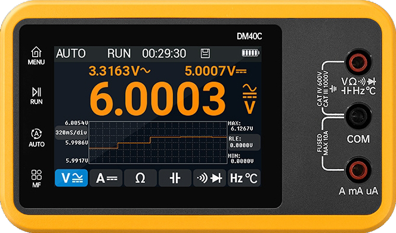
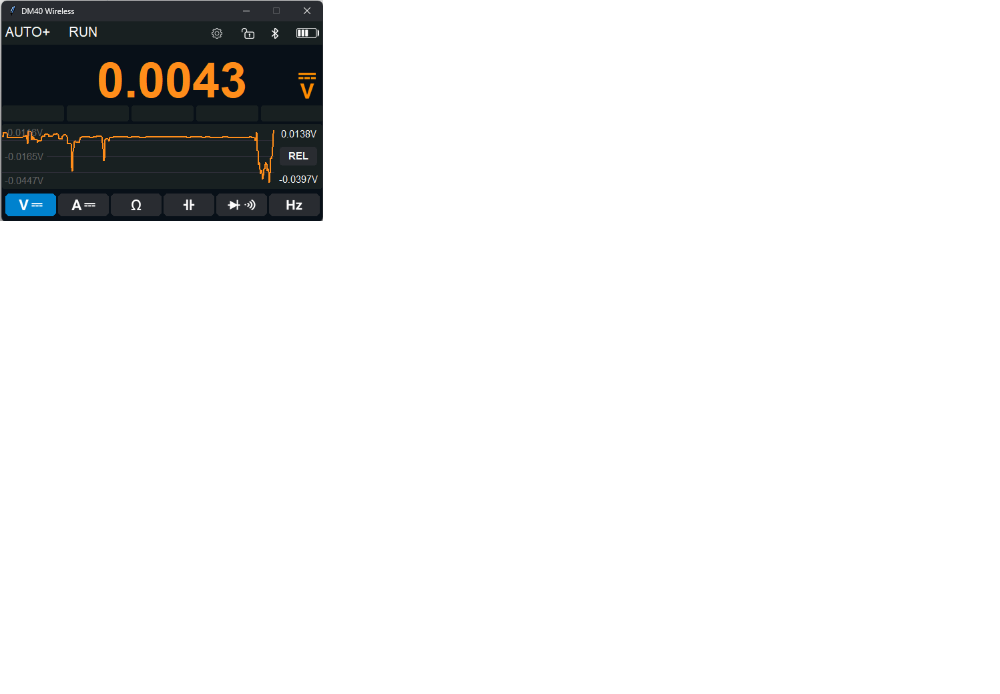
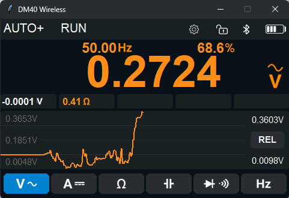
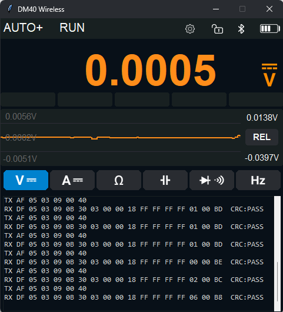
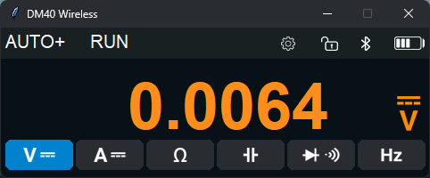
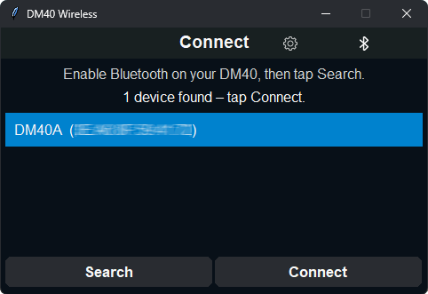
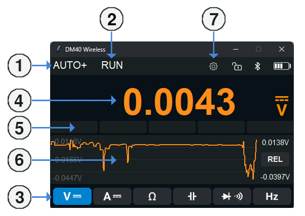
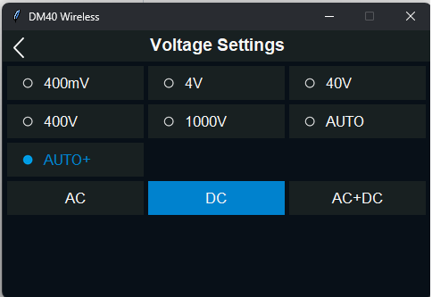
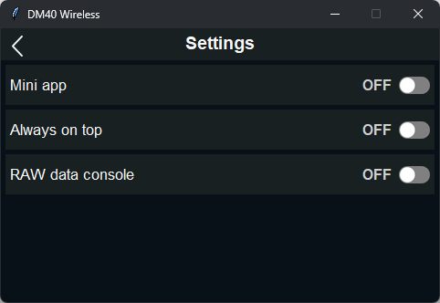
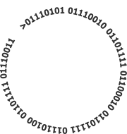

# DM40 Wireless

<p align="center" width="100%">
    
</p>

A Windows desktop app that connects over **Bluetooth Low Energy (BLE)** to the wireless **Alientek DM40** multimeter (DM40A, DM40B, DM40C). The UI mirrors the device display, including measurement modes, ranges, HOLD, and saved values.

**Repository:** [github.com/Urobotos/DM40-Wireless](https://github.com/Urobotos/DM40-Wireless)

| Branch     | Purpose                                     |
| ---------- | ------------------------------------------- |
| `main`     | Stable releases matching GitHub Releases    |
| `develop`  | Active development, new features and fixes  |

<br>

---

## Requirements:

- **Alientek DM40** multimeter (A / B / C) within range
- **Windows 10/11** with working **Bluetooth Low Energy (BLE)** — available for Bluetooth versions 4.0+
- To run from source: **Python 3.11+** ([python.org](https://www.python.org/)) — check **`Add python to PATH`** during installation

<br>

---

## Running from Windows (Installation for end users):

1. Open [Releases](https://github.com/Urobotos/DM40-Wireless/releases) on GitHub and download **`DM40-Wireless-win64.zip`**
2. Extract the zip to any folder (e.g. `C:\Apps\DM40 Wireless\`)
3. Run **`DM40 Wireless.exe`** <br><br>
4. On first launch, the **Connect** screen appears — search for your meter, select it in the list, and click **Connect**. <br>
   The MAC address is saved to `settings.json` next to the exe, on the next launch the app connects automatically.

<br>

> The App runs only from the extracted folder — **it does not install**. <br>
> Do not move the `DM40 Wireless.exe` file outside its own folder, instead you can create a shortcut on your desktop.

<br>

---

## Running from source (developers):

```bat
git clone -b develop https://github.com/Urobotos/DM40-Wireless.git
cd DM40-Wireless
.\install.bat
```

*(* `install.bat` *creates* `.venv`*, installs dependencies from* `requirements.txt`*, and installs* `Nuitka` *for building )* <br><br>

On first run, copy the settings template:

```bat
copy settings.example.json settings.json
```

<br>
Then start the app using one of these:

| Method                       | Description                                                                          |
| ---------------------------- | ------------------------------------------------------------------------------------ |
| **`DM40 Wireless.bat`**      | Recommended (Windows clickable) - runs `app.pyw` without a console                   |
| **`app.py`**                 | PowerShell cmd: `.\.venv\Scripts\python.exe app.py` - with console (debugging, logs) |

<br>

---

## App Screenshots:

<p style="text-align: left">
    
    
    
    
</p>

<br>

---

## Using the app:

### Connect screen (first launch / empty MAC):



- **Search** — scan for nearby DM40 BLE devices
- Click a list row — select a device
- **Connect** — save MAC and model, connect, and go to the main screen
- ⚙️ In the **Settings** you can change the language | ⚙️ 在**设置**中，您可以更改语言。

### Main screen:

<p style="text-align: left">
    
</p>

| Area                   | Action                                                                                                  |
| ---------------------- | ------------------------------------------------------------------------------------------------------- |
| **1. AUTO+**           | Opens the **RANGE screen** menu for the current mode (Clickable)                                        |
| **2. RUN / HOLD**      | Toggles measurement hold (Clickable)                                                                    |
| **3. MODE buttons**    | Cycle sub-modes: VDC/VAC, ADC/AAC, OHM, CAP, DIODE/CONT, Hz/TEMP                                        |
| **4. Display digits**  | Main display digits                                                                                     |
| **5. Save slots**      | Click on the **display digits** to save values to slots (max. 6), hold on display digits to clear slots |
| **6. Graph**           | Live measurement plot (hidden in Mini app mode), hold in the graph area to clear it                     |
| **7. Settings** ⚙️     | Opens **Settings screen**                                                                               |
| **8. REL button**      | REL = **Relative mode**, click to set, hold button to cancel                                            |

Connection status, meter battery, and units are shown in the top bar from live BLE data.

### RANGE screen:



- List of ranges for the current measurement mode (depends on DM40A/B/C model)
- ❮ **Back** — return to the main screen

### Settings screen:



| Setting                 | Function                                                                                                                 |
| ----------------------- | ------------------------------------------------------------------------------------------------------------------------ |
| **Mini app**            | Smaller window without graph and save slots                                                                              |
| **Always on top**       | Keep the window above other apps                                                                                         |
| **RAW data console**    | Panel below the UI showing BLE TX/RX packets (protocol debugging)                                                        |
| **Language**            | Tap the current language to pick from installed `.toml` files. The folder icon opens `i18n\` for custom translations     |

Changes are saved to `settings.json`.

<br>

---

## Configuration (`settings.json`):

The file lives next to the exe or in the project root. It is not committed to git — use `settings.example.json` as a template.

| Key              | Meaning                                                                                      |
| ---------------- | -------------------------------------------------------------------------------------------- |
| `target_mac`     | DM40 MAC address (empty `""` show Connect screen)                                            |
| `model_name`     | `DM40A`, `DM40B`, or `DM40C`                                                                 |
| `device_counts`  | Range count scale (40k / 50k / 60k)                                                          |
| `window_scale`   | Window scale (`1.0` = 480×300 logical px)                                                    |
| `mini_app`       | Mini mode (boolean: false / true)                                                            |
| `always_on_top`  | Always on top (boolean: false / true)                                                        |
| `raw_console`    | RAW console (boolean: false / true)                                                          |
| `language`       | UI language code matching a file in `i18n/` (e.g. `"en-US"`, `"zh-CN"`, default `"en-US"`)   |
| `gui_font`       | Configurable UI font family, default `"Arial"`                                               |

<br>

---

## Building the exe and release zip (maintainers):

```bat
build_exe.bat
release_zip.bat
```

> To build the exe, **Visual Studio 2022/2025/2026** with the **Desktop development with C++** workload is required. <br>
> The build script (`build_exe.bat`) auto-detects MSVC — no manual path setup needed.

<br>

- **`build_exe.bat`** (Nuitka `--standalone` + MSVC)
  - Auto-detects Visual Studio 2022/2025/2026 (requires `Desktop development with C++` workload)
  - Copies `i18n\*.toml` and `settings.example.json` into the distribution folder
  - Uses folder `--standalone` mode (not `--onefile`) to reduce Windows Defender false positives
  - To the build output folder: `dist\DM40 Wireless\` <br><br>
- **`release_zip.bat`** 
  - Packages: `dist\DM40 Wireless\` → `release\DM40-Wireless-win64.zip`

<br>

**To publish a release on GitHub:**

1. Build the exe file using `build_exe.bat` and the zip file using `release_zip.bat` (see above)
2. Create a new Release from `main` with a tag such as `v1.0.0`
3. Attach **`DM40-Wireless-win64.zip`** as a release asset
4. Source code stays in the repo, users download the zip, developers clone the repo

<br>

---

## Project structure:

```
DM40-Wireless/
├── ble/                      # BLE worker, discovery
├── core/                     # Protocol, parsing, modes, config
├── gui/                      # Tkinter UI, layout
├── i18n/                     # Language .toml files
├── images/                   # UI graphics
├── release/                  # Release archives (not in git)
├── tools/7-Zip               # 7-Zip tool package for release_zip.bat
├── dist/                     # Build output (not in git)
│   └── DM40 Wireless/           # Standalone distribution folder
│       ├── i18n/                  # External language files
│       ├── DM40 Wireless.exe      # launcher (Windows clickable)
│       ├── settings.json          # Default runtime config
│       ├── dm40_ui_state.json     # UI state (auto-generated at runtime)
│       └── *.dll                  # Runtime DLLs / bundled data
│
├── DM40 Wireless.bat         # Dev launcher (Windows clickable)
├── app.py, app.pyw           # Entry points
├── settings.example.json     # Settings template
├── requirements.txt          # Python dependencies
├── install.bat               # venv + deps + Nuitka installer
├── build_exe.bat             # Nuitka --standalone + MSVC build
└── release_zip.bat           # Release package script
```

<br>

---

## Notes:

- This is not an official Alientek product, it is a community / enthusiast project.
- The multimeter communicates using Bluetooth Low Energy (BLE), BLE support is available for Bluetooth versions 4.0 and above.
- Bluetooth must be enabled in Windows, if BT is off, the app shows a warning.


<br>

---

## License:

<p align="center" width="100%">
     This project is licensed under the MIT License (open source) — Copyright (c) 2026 Urobotos.
</p>

<p align="center" width="100%">
    
</p>

<br>

&nbsp; &nbsp; &nbsp; &nbsp; &nbsp; &nbsp; &nbsp; &nbsp; &nbsp; &nbsp; &nbsp; &nbsp; &nbsp; &nbsp; &nbsp; &nbsp; &nbsp; &nbsp; &nbsp; &nbsp;  &nbsp; &nbsp; &nbsp; &nbsp; &nbsp; &nbsp; &nbsp; &nbsp; &nbsp; &nbsp; &nbsp; &nbsp; &nbsp; &nbsp; &nbsp; &nbsp; &nbsp; &nbsp; &nbsp; &nbsp; &nbsp; &nbsp; &nbsp; &nbsp; &nbsp; &nbsp; &nbsp; &nbsp; &nbsp; &nbsp; &nbsp; &nbsp; &nbsp; &nbsp; &nbsp; &nbsp; &nbsp; &nbsp; &nbsp; &nbsp; &nbsp; &nbsp; &nbsp; &nbsp; &nbsp; &nbsp; &nbsp; &nbsp; &nbsp; &nbsp; &nbsp; &nbsp; &nbsp; &nbsp; &nbsp; &nbsp; &nbsp; &nbsp; &nbsp; &nbsp; &nbsp; &nbsp; &nbsp; &nbsp; &nbsp; [MIT License](LICENSE)
<br>
<br>


